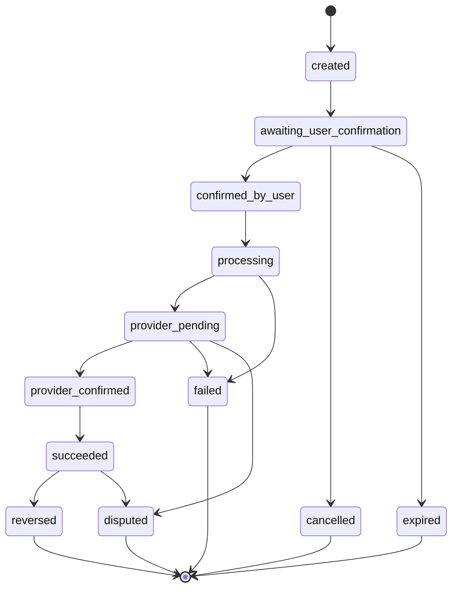
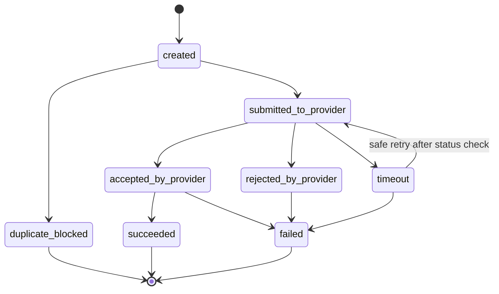
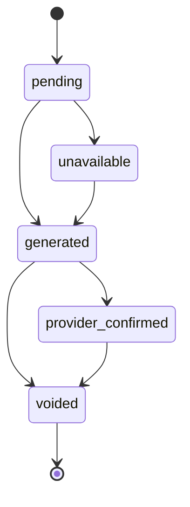

# Payment State Machine

Updated: 2026-05-20

This document defines the future payment state model for FondixPay. It is design only and does not change the current mock/dev implementation.

## PaymentIntent States

- `created`
- `awaiting_user_confirmation`
- `confirmed_by_user`
- `processing`
- `provider_pending`
- `provider_confirmed`
- `succeeded`
- `failed`
- `cancelled`
- `expired`
- `reversed`
- `disputed`

## PaymentAttempt States

- `created`
- `submitted_to_provider`
- `accepted_by_provider`
- `rejected_by_provider`
- `timeout`
- `failed`
- `succeeded`
- `duplicate_blocked`

## Receipt States

- `pending`
- `generated`
- `provider_confirmed`
- `unavailable`
- `voided`

## Allowed Transitions

| Entity | From | To | Required Evidence |
| --- | --- | --- | --- |
| PaymentIntent | `created` | `awaiting_user_confirmation` | Intent stored with amount, fee, total, currency, idempotency key, correlation ID. |
| PaymentIntent | `awaiting_user_confirmation` | `confirmed_by_user` | User confirmation and audit event. |
| PaymentIntent | `confirmed_by_user` | `processing` | Idempotency accepted and provider submission starting. |
| PaymentIntent | `processing` | `provider_pending` | Provider request sent or accepted for async processing. |
| PaymentIntent | `provider_pending` | `provider_confirmed` | Provider confirmation, webhook, polling, or reconciliation evidence. |
| PaymentIntent | `provider_confirmed` | `succeeded` | Ledger entries recorded and receipt status updated. |
| PaymentIntent | `succeeded` | `reversed` | Explicit reversal flow and compensating ledger entries. |
| PaymentAttempt | `created` | `duplicate_blocked` | Existing idempotency key result found. |
| PaymentAttempt | `submitted_to_provider` | `timeout` | Provider response not received within allowed window. |
| Receipt | `generated` | `provider_confirmed` | Provider confirmation rules satisfied. |

## Prohibited Transitions

- `created` -> `succeeded` without user confirmation and provider evidence.
- `processing` -> `succeeded` without provider confirmation.
- `timeout` -> `succeeded` without follow-up provider confirmation.
- `failed` -> `succeeded` on the same attempt without creating a new attempt or recovery event.
- `succeeded` -> `failed`; use `reversed` or `disputed` instead.
- Any financial deletion instead of append-only correction/reversal.

## Retry Cases

- Retry before provider submission may reuse the same PaymentIntent.
- Retry after provider timeout requires status check or provider-safe retry semantics.
- Retry must preserve `correlation_id`.
- Retry must generate `payment.retry_requested`.
- Duplicate retry with same idempotency key returns current known state.

## Timeout Cases

- Timeout is ambiguous, not success.
- User-facing status should be "Pendiente de confirmacion" or "Requiere soporte" depending on elapsed time and provider evidence.
- Timeout must create audit event `payment.provider_timeout`.
- Reconciliation must later resolve timeout if provider report confirms or rejects.

## Duplicate Cases

- Duplicate confirmation should create or return `duplicate_blocked`.
- No second provider submission should occur for same idempotency scope.
- Audit event `payment.duplicate_blocked` is required.

## Reversal Cases

- Reversal requires a succeeded or provider-confirmed payment.
- Reversal must create compensating ledger entries.
- Receipt may become `voided`.
- User-facing copy must not hide the prior successful state.

## Reconciliation Cases

- Provider success while internal pending: move to manual review, then provider-confirmed if valid.
- Internal success while provider missing: manual review and possible reversal.
- Amount mismatch: block final success and create reconciliation mismatch.
- Duplicate provider reference: manual review before user-facing finality.

## Phase 5B Implementation Status

Implemented in `backend/app/modules/ledger/state_machine.py`:

- PaymentIntent states: `created`, `awaiting_user_confirmation`, `confirmed_by_user`, `processing`, `provider_pending`, `provider_confirmed`, `succeeded`, `failed`, `cancelled`, `expired`, `reversed`, `disputed`.
- PaymentAttempt states: `created`, `submitted_to_provider`, `accepted_by_provider`, `rejected_by_provider`, `timeout`, `failed`, `succeeded`, `duplicate_blocked`.
- Validators reject invalid transitions through `InvalidStateTransition`.

Current mock success path:

1. `created`
2. `awaiting_user_confirmation`
3. `confirmed_by_user`
4. `processing`
5. `provider_pending`
6. `provider_confirmed`
7. `succeeded`

Pending for provider phases:

- Timeout handling.
- Reversal and dispute workflows.
- Retry after provider ambiguity.
- Reconciliation-driven status correction.
# Phase 5F Mock Recovery Status

Mobile mock/dev recovery now exposes:

- `succeeded`: routes to PaymentSuccess.
- `failed`: routes to PaymentFailed.
- `pending`: routes to PaymentPending.
- `timeout`: routes to PaymentPending with “en verificación” copy.
- `duplicate_blocked`: routes to PaymentFailed with duplicate-safe copy.

Mock retry returns to confirmation and uses the selected method flow again. Pending/timeout are never shown as success. Provider-grade retries, provider status polling, receipt recovery, and reconciliation remain future backend/provider work.

## Phase 8B Card To Service Payment States

Future provider orchestration must represent:

- `card_charge_succeeded`
- `service_payment_not_started`
- `service_payment_submitted`
- `service_payment_pending`
- `service_payment_confirmed`
- `service_payment_failed`
- `service_payment_timeout`
- `manual_review_required`

Required rules:

- `card_charge_failed` does not transition to `service_payment_submitted`.
- Pending, timeout, or unknown card state does not transition to service execution.
- `service_payment_timeout` is not success.
- Ambiguous Prontipagos outcomes transition to `manual_review_required` or a status-check path before any retry.

## Phase 8C Sandbox State Alignment

- Sandbox card `succeeded` continues to Prontipagos mock execution.
- Sandbox card `declined` or `failed` marks the sandbox payment failed and service payment `not_started`.
- Sandbox card `pending`, `timeout`, or auth-required remains manual-review/pending and service payment `not_started`.
- Prontipagos mock `provider_confirmed` can generate receipt and success.
- Prontipagos mock `provider_pending`, `provider_timeout`, `provider_failed`, `provider_rejected`, or duplicate-blocked remains recovery/manual review and does not generate confirmed receipt.
